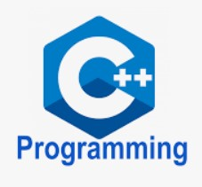

### Hi there 👋
# Artificial Intelligence Student
 ## 🔭 I am Currently Graduated from DKTE Society's Textile and Engineering Institute.

- 🔭 I’m currently working on Claim Portal for IEEE Bombay Section.
- 🌱 I’m currently learning React and Express.js
- 👯 I’m looking to collaborate on Full Stack Web Development Projects
- 🤔 I’m looking for help with NLP 

## ⚡ Technologies I use 

<table align="center">
    <tr>
        <td align="center" width="140" height="112.43">
            
              React
        </td>
        <td align="center" width="140" height="112.43">
            
              Express
        </td>
        <td align="center" width="140" height="112.43">
            
              Python
        </td>
        <td align="center" width="140" height="112.43">
            
              Google Colab
        </td>
        <td align="center" width="140" height="112.43">
            
              Svelte
        </td>
        <td align="center" width="140" height="112.43">
            
              Java
        </td>
        <td align="center" width="140" height="112.43">
            
              C++
        </td>
    </tr>
</table>

